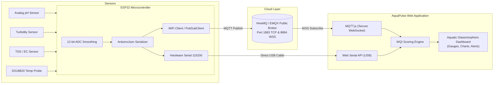

# AquaPulse IoT — Smart Water Quality Monitoring System

A real-time, responsive IoT web application designed to monitor, analyze, and visualize hydrochemical sensor data streamed from an **ESP32 microcontroller**. 

Deployable with zero build steps to **GitHub Pages**, **Vercel**, or **Netlify** to get an instant public URL accessible from any device worldwide.

---

## Key Highlights

- **Dual Connection Modes**:
  - **Cloud MQTT (WSS)**: Real-time sub-second streaming from ESP32 to web app via Secure WebSockets (`wss://broker.hivemq.com:8884/mqtt`). No server setup required!
  - **Direct USB Web Serial**: Plug ESP32 directly into your computer via USB in Chrome/Edge and monitor telemetry at 115200 baud without Wi-Fi.
  - **Realistic Simulator**: Built-in simulator with anomaly injection (Acid spill, Muddy runoff, Salinity surge) to test charts, gauges, and alerts immediately.
- **Automated Water Quality Index (WQI)**:
  - Standardized weighted arithmetic algorithm scoring water from 0 to 100 (*Excellent*, *Good*, *Moderate*, *Poor*, *Unsafe*).
- **Comprehensive Sensor Telemetry**:
  - **pH Sensor** (Acidity/Alkalinity, 0–14 scale)
  - **Turbidity Sensor** (Water clarity, 0–1000 NTU)
  - **TDS Sensor** (Total Dissolved Solids / Conductivity in ppm)
  - **Water Temperature** (DS18B20 digital waterproof probe in °C)
  - **Dissolved Oxygen (DO)** (Aquatic biological safety in mg/L)
  - **Reservoir / Depth Level** (% capacity)
- **Visual & Audio Alert System**:
  - Configurable safety thresholds with audio chime alerts (Web Audio API) and pulsing visual hazard banners.
- **Integrated ESP32 Firmware Generator**:
  - Tailor your Wi-Fi SSID, password, Station ID, and pinout assignments directly in the web app, then copy or download the ready-to-flash `.ino` sketch.
- **Export & Analytics**:
  - Real-time Chart.js spline streaming graphs and one-click CSV/JSON export.

---

## Architecture Diagram



---

## 1-Click Deployment Guide (Get Your Web Link)

### Option 1: GitHub Pages (Free & Automatic)
This repository includes a pre-configured GitHub Actions workflow (`.github/workflows/deploy.yml`):
1. Push this repository to GitHub:
   ```bash
   git add .
   git commit -m "Deploy AquaPulse IoT Dashboard"
   git push origin main
   ```
2. In your GitHub repository, navigate to **Settings** → **Pages**.
3. Under **Build and deployment** → **Source**, select **GitHub Actions**.
4. Your dashboard will be live at:
   ```
   https://<your-github-username>.github.io/Water-Quality-Monitoring/
   ```

### Option 2: Vercel (1-Click)
1. Go to [vercel.com](https://vercel.com) and click **"Add New Project"**.
2. Import your `Water-Quality-Monitoring` GitHub repository.
3. Keep default settings and click **Deploy**.
4. You receive an instant public link: `https://water-quality-monitoring.vercel.app`.

### Option 3: Netlify (Drag & Drop or Git)
1. Go to [app.netlify.com](https://app.netlify.com).
2. Drag and drop this project folder or link your GitHub repo.
3. Deploy!

---

## Connecting Your ESP32 to the Web App

### Method A: Cloud MQTT over Wi-Fi (Recommended for remote link)
1. Open the Web App using your deployed link or locally.
2. Note your **Station ID** (or click the Settings gear icon to choose your own, e.g., `station-pond-01`).
3. Open the **ESP32 Firmware** modal in the web app:
   - Enter your Wi-Fi SSID & Password.
   - Click **Download .ino** (or use [`firmware/WaterQuality_ESP32.ino`](firmware/WaterQuality_ESP32.ino)).
4. Flash the code to your ESP32 via the Arduino IDE.
5. In the Web App, click **Cloud MQTT**. The dashboard will display **Connected** and live telemetry will start streaming!

### Method B: Direct USB Serial (No Wi-Fi required)
1. Plug your ESP32 into your computer using a micro-USB / USB-C cable.
2. Open the Web App in **Google Chrome**, **Microsoft Edge**, or **Opera**.
3. Click the **USB Serial** button in the header.
4. Select your ESP32 COM port from the browser prompt and click **Connect**.
5. Live sensor readings will stream directly into the dashboard at 115200 baud!

---

## Hardware Pinout & Wiring

| Component | ESP32 GPIO | Operating Voltage | Notes |
| :--- | :--- | :--- | :--- |
| **pH Sensor Module** | `GPIO 34` (ADC1_6) | 5V / VIN | Connect `Po` or `A0` to GPIO 34. Calibrate with 4.01 & 6.86 buffers. |
| **Turbidity Sensor** | `GPIO 35` (ADC1_7) | 5V / VIN | Set physical switch on module adapter to **'A' (Analog)**. |
| **TDS Meter Module** | `GPIO 32` (ADC1_4) | 3.3V or 5V | Submerge probe pins into liquid only. |
| **DS18B20 Temp Probe** | `GPIO 4` (Digital) | 3.3V | Requires a **4.7 kΩ pull-up resistor** between `VCC` and `Data (GPIO 4)`. |
| **Status Indicator LED** | `GPIO 2` | Internal | Blinks during Wi-Fi connection; solid when connected. |

> [!TIP]
> Always use **ADC1 pins** (GPIO 32, 33, 34, 35, 36, 39) on the ESP32 when using Wi-Fi, because ADC2 is shared with the internal Wi-Fi radio.

---

## Arduino IDE Setup

1. In Arduino IDE, open **Tools** → **Manage Libraries...** and install:
   - `PubSubClient` by Nick O'Leary
   - `ArduinoJson` by Benoit Blanchon (v6.x or v7.x)
   - `OneWire` by Jim Studt, Paul Stoffregen
   - `DallasTemperature` by Miles Burton
2. Select Board: **ESP32 Dev Module** (or your specific ESP32 variant).
3. Select the correct **COM Port** and click **Upload**.

---

## Telemetry Payload Specification

The ESP32 sends a compact JSON packet at regular intervals (default 2 seconds):

```json
{
  "stationId": "esp32-station-01",
  "ph": 7.35,
  "turbidity": 1.82,
  "tds": 215,
  "temp": 23.6,
  "dissolvedOxygen": 7.8,
  "waterLevel": 82,
  "rssi": -58
}
```

---

## Testing & Local Development

To run the web app locally on your machine:
```bash
# Using Node.js npx serve (zero install required):
npx serve .
```
Then open `http://localhost:3000` in your browser.
